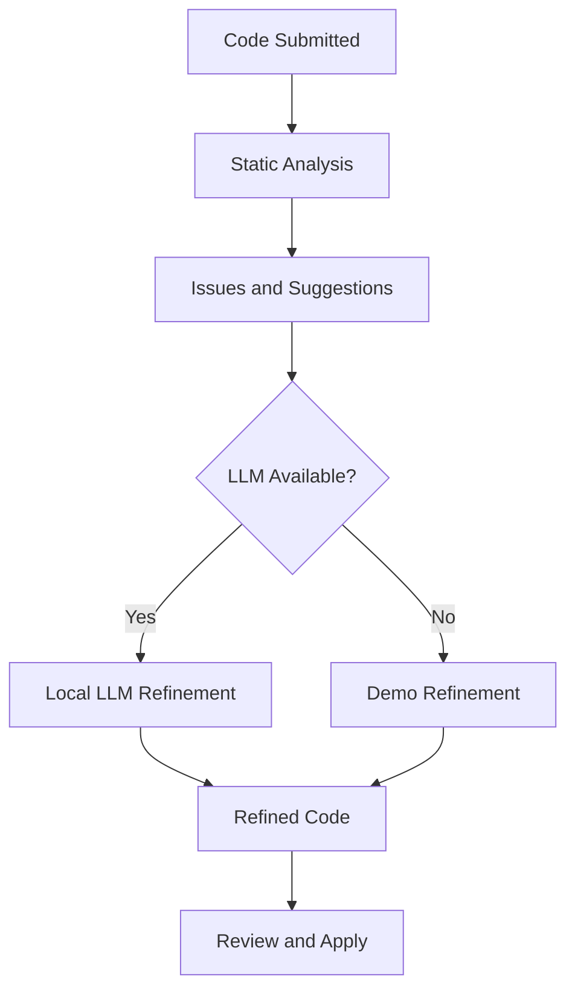
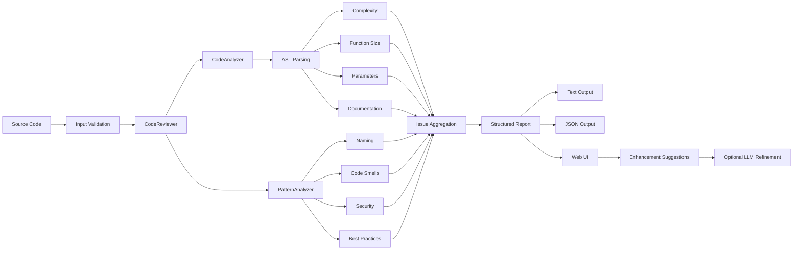
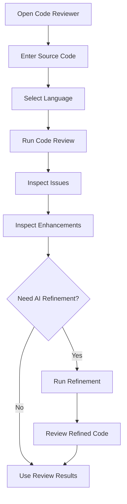
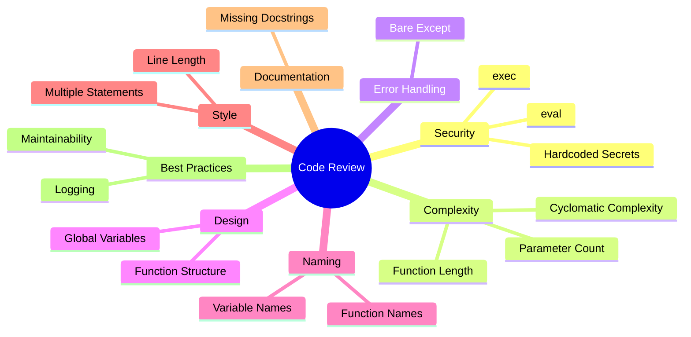
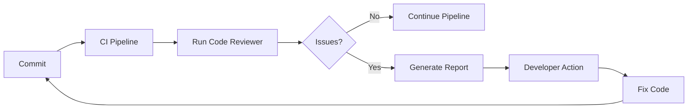

<div align="center">

# CodeLens

### Static Analysis, Code Quality & Local AI-Assisted Code Refinement

<p align="center">
  <a href="https://github.com/ShazinHijazy/code-reviewer">
    
  </a>
  <a href="https://github.com/ShazinHijazy/code-reviewer/blob/main/LICENSE">
    
  </a>
  <a href="https://github.com/ShazinHijazy/code-reviewer">
    
  </a>
</p>

<p align="center">
  
  
  
  
  
</p>

<p align="center">
  A local-first code review platform that combines deterministic static analysis,
  rule-based code quality checks, actionable enhancement suggestions, and optional
  local LLM-assisted refinement.
</p>

<p align="center">
  <a href="#overview">Overview</a> •
  <a href="#features">Features</a> •
  <a href="#architecture">Architecture</a> •
  <a href="#installation">Installation</a> •
  <a href="#usage">Usage</a> •
  <a href="#testing">Testing</a> •
  <a href="#documentation">Documentation</a>
</p>

</div>

---

## Overview

**Code Reviewer** is a Python-focused code analysis and refinement platform designed to identify common software quality, security, maintainability, and style problems before they become harder to address.

The project combines two complementary approaches:

1. **Deterministic static analysis**
2. **Optional AI-assisted code refinement**

The static analysis layer uses Python's Abstract Syntax Tree (AST) representation together with pattern-based checks. It can identify issues such as excessive cyclomatic complexity, oversized functions, excessive parameters, missing documentation, unsafe functions, hardcoded credentials, poor naming, bare exception handling, excessive line length, and multiple statements on a single line.

The web application provides a browser-based interface for submitting code, reviewing detected issues, examining enhancement suggestions, and optionally refining code using an available LLM provider or local Ollama-based models.

### Design Objective

The central design objective can be expressed as:

$$
\text{Code Input}
\rightarrow
\text{Static Analysis}
\rightarrow
\text{Issue Detection}
\rightarrow
\text{Actionable Feedback}
\rightarrow
\text{Optional Refinement}
$$

The system deliberately separates deterministic analysis from generative refinement. This makes the detected issues explainable and reproducible while allowing AI assistance to be introduced when deeper code transformation or improvement is useful.

---

## Why Code Reviewer?

Modern development workflows often combine linters, static analyzers, code review tools, and increasingly, AI-based assistants. These approaches solve different parts of the same problem.

Code Reviewer is designed around a simple principle:

> **Use deterministic analysis to identify measurable problems, then use AI only where assisted reasoning or refinement provides additional value.**

This separation provides several practical advantages:

<div align="center">

<table>
<tr>
<th align="center">Capability</th>
<th align="center">Approach</th>
<th align="center">Benefit</th>
</tr>
<tr>
<td align="center">Structural analysis</td>
<td align="center">Python AST</td>
<td align="center">Deterministic</td>
</tr>
<tr>
<td align="center">Pattern detection</td>
<td align="center">Rule-based matching</td>
<td align="center">Transparent</td>
</tr>
<tr>
<td align="center">Security checks</td>
<td align="center">Explicit rules</td>
<td align="center">Auditable</td>
</tr>
<tr>
<td align="center">Enhancement suggestions</td>
<td align="center">Rule-driven analysis</td>
<td align="center">Actionable</td>
</tr>
<tr>
<td align="center">Code refinement</td>
<td align="center">Optional LLM</td>
<td align="center">Assisted transformation</td>
</tr>
<tr>
<td align="center">Execution model</td>
<td align="center">Local application</td>
<td align="center">Privacy-oriented</td>
</tr>
</table>

</div>

---

# Features

## Static Code Analysis

The core reviewer performs structural and pattern-based analysis.

### AST-Based Analysis

The AST analyzer examines Python program structure and checks for:

* Cyclomatic complexity
* Function length
* Excessive function parameters
* Missing function documentation
* Missing class documentation
* Structural characteristics of functions and classes
* Syntax-related problems

The current complexity calculation starts from a base complexity of one and increments it for selected branching and exception constructs.

$$
C = 1 + \sum_{i=1}^{n} b_i
$$

where:

* $C$ is the calculated cyclomatic complexity,
* $b_i$ represents a detected decision or branching construct.

---

## Pattern-Based Analysis

The pattern analyzer complements AST analysis with source-level checks.

Current checks include:

<div align="center">

<table>
<tr>
<th align="center">Category</th>
<th align="center">Examples</th>
<th align="center">Severity Range</th>
</tr>
<tr>
<td align="center">Security</td>
<td align="center"><code>eval()</code>, <code>exec()</code>, hardcoded secrets</td>
<td align="center">Critical</td>
</tr>
<tr>
<td align="center">Error Handling</td>
<td align="center">Bare <code>except:</code></td>
<td align="center">High</td>
</tr>
<tr>
<td align="center">Design</td>
<td align="center">Global variables, excessive parameters</td>
<td align="center">Medium</td>
</tr>
<tr>
<td align="center">Naming</td>
<td align="center">Single-letter variables, invalid function naming</td>
<td align="center">Low</td>
</tr>
<tr>
<td align="center">Style</td>
<td align="center">Long lines, multiple statements</td>
<td align="center">Low</td>
</tr>
<tr>
<td align="center">Documentation</td>
<td align="center">Missing docstrings</td>
<td align="center">Low</td>
</tr>
</table>

</div>

The implementation currently includes explicit checks for dangerous functions, hardcoded credentials, bare exception handlers, print-based logging, global variables, naming conventions, line length, and multiple statements per line.

---

## Severity-Based Reporting

Issues are organized into five severity levels:

<div align="center">

|     Severity    |                            Meaning                           |
| :-------------: | :----------------------------------------------------------: |
| 🔴 **CRITICAL** | Security or correctness issues requiring immediate attention |
|   🟠 **HIGH**   |      Important issues that should be addressed promptly      |
|  🟡 **MEDIUM**  |          Moderate maintainability or design concerns         |
|    🔵 **LOW**   |             Minor quality and style improvements             |
|    ⚪ **INFO**   |                    Informational feedback                    |

</div>

Each issue contains structured information including:

* Line number
* Column
* Severity
* Rule identifier
* Human-readable message
* Suggested remediation
* Issue category

The structured representation is exposed through the review report and JSON output.

---

# Enhancement Suggestions

The project includes a separate enhancement layer intended to move beyond simply reporting problems.

Enhancement suggestions can provide:

* Readability improvements
* Maintainability improvements
* Performance-oriented suggestions
* Security improvements
* Concurrency considerations
* Documentation improvements
* Design-pattern suggestions
* General best-practice recommendations

The web application exposes these suggestions through the `/api/enhancements` endpoint.

---

# Local LLM-Assisted Refinement

Code Reviewer can optionally use local or configured LLM capabilities for code refinement.

The application supports an LLM refinement workflow in which detected issues and enhancement information can be supplied to a refinement layer. When an LLM provider is unavailable, the application can fall back to its built-in demonstration refinement mode.

### Local Ollama Workflow

For local AI-assisted refinement, the project provides Ollama integration documentation and can automatically detect an available Ollama service.

A typical workflow is:



The repository's application layer explicitly exposes LLM provider status and supports Ollama-based refinement.

> **Privacy note:** Local Ollama usage is intended to keep model inference on the user's machine. API-based LLM configurations, where enabled by the project configuration, should be treated according to the privacy and data policies of the selected provider.

---

# Architecture

The system is organized around a layered analysis pipeline.



The architecture documentation describes the core components as `CodeAnalyzer`, `PatternAnalyzer`, and `CodeReviewer`, followed by issue aggregation and report generation.

---

## Analysis Pipeline

At a conceptual level:

$$
\mathcal{R}(x)=
\mathcal{A}*{AST}(x)
\cup
\mathcal{A}*{Pattern}(x)
$$

where:

* $x$ is the submitted source code,
* $\mathcal{A}_{AST}$ represents structural AST-based analysis,
* $\mathcal{A}_{Pattern}$ represents source-pattern analysis,
* $\mathcal{R}(x)$ is the resulting collection of review issues.

The aggregated issues are then transformed into a structured report:

$$
\mathcal{R}(x)
\rightarrow
{
\text{line},
\text{column},
\text{severity},
\text{code},
\text{message},
\text{suggestion},
\text{category}
}
$$

This structure allows the same analysis results to be consumed by the command-line workflow, API, and web interface.

---

# System Components

<div align="center">

<table>
<tr>
<th align="center">Component</th>
<th align="center">Responsibility</th>
</tr>
<tr>
<td align="center"><code>CodeAnalyzer</code></td>
<td align="center">AST-based structural analysis</td>
</tr>
<tr>
<td align="center"><code>PatternAnalyzer</code></td>
<td align="center">Pattern and source-level checks</td>
</tr>
<tr>
<td align="center"><code>CodeReviewer</code></td>
<td align="center">Coordinates analysis and reporting</td>
</tr>
<tr>
<td align="center"><code>EnhancementSuggestions</code></td>
<td align="center">Generates improvement recommendations</td>
</tr>
<tr>
<td align="center"><code>LLM Handler</code></td>
<td align="center">Coordinates optional AI-assisted refinement</td>
</tr>
<tr>
<td align="center"><code>MCP Server</code></td>
<td align="center">Supports agent-oriented orchestration functionality</td>
</tr>
<tr>
<td align="center">Flask Application</td>
<td align="center">Provides web UI and REST API</td>
</tr>
</table>

</div>

The current `src/` directory contains the reviewer engine, enhancement module, LLM handler, MCP server, and open-source LLM integration components.

---

# Installation

## Prerequisites

<div align="center">

<table>
<tr>
<th align="center">Requirement</th>
<th align="center">Purpose</th>
</tr>
<tr>
<td align="center">Python 3.8+</td>
<td align="center">Application runtime</td>
</tr>
<tr>
<td align="center">pip</td>
<td align="center">Dependency installation</td>
</tr>
<tr>
<td align="center">Ollama</td>
<td align="center">Optional local LLM refinement</td>
</tr>
</table>

</div>

The repository currently documents Python 3.8+ as the baseline requirement.

## Clone the Repository

```bash
git clone https://github.com/ShazinHijazy/code-reviewer.git
cd code-reviewer
```

## Install Dependencies

```bash
pip install -r requirements.txt
```

## Start the Web Application

```bash
python3 app.py
```

The current application documentation uses port `5002` for the main web interface.

Open:

```text
http://127.0.0.1:5002
```

---

# Optional Ollama Setup

Ollama is optional and is used for local LLM-assisted refinement.

### Install Ollama

Install Ollama for your operating system using the official installation instructions.

Then start the service:

```bash
ollama serve
```

Pull a suitable model:

```bash
ollama pull mistral
```

Alternatively:

```bash
ollama pull codellama
```

The existing repository documentation identifies Ollama as an optional component and provides a dedicated setup guide.

---

# Usage

## Web Interface

The primary workflow is:



### Typical workflow

1. Open the web interface.
2. Enter or paste source code.
3. Select the relevant language.
4. Run the code review.
5. Inspect detected issues.
6. Review enhancement suggestions.
7. Optionally run LLM-assisted refinement.
8. Compare the original and refined code.
9. Copy or download the resulting code.

The current application exposes dedicated API routes for review, enhancements, refinement, provider status, and related functionality.

---

# Command-Line Workflow

The repository documentation also describes a command-line workflow for the static analysis engine.

### Review a Python file

```bash
python cli.py example_bad.py
```

### Review a directory

```bash
python cli.py .
```

### Generate JSON output

```bash
python cli.py example_bad.py --format json
```

### Restrict analysis by extension

```bash
python cli.py . --extension .py
```

> The command-line examples above follow the repository's documented static-analysis workflow.

---

# Python API

The reviewer can also be used programmatically.

```python
from code_reviewer import CodeReviewer

code = """
def calculate(value):
    return eval(value)
"""

reviewer = CodeReviewer(code, "example.py")

issues = reviewer.review()

for issue in issues:
    print(issue)

report = reviewer.get_report()
print(report)
```

The API returns structured review information that can be consumed by other Python applications or automation workflows.

---

# REST API

The Flask application provides REST endpoints for programmatic integration.

## Review Code

```bash
curl -X POST http://127.0.0.1:5002/api/review \
  -H "Content-Type: application/json" \
  -d '{
    "code": "for i in range(len(items)):\n    result = result + items[i]",
    "language": "python",
    "filename": "code.py"
  }'
```

## Generate Enhancements

```bash
curl -X POST http://127.0.0.1:5002/api/enhancements \
  -H "Content-Type: application/json" \
  -d '{
    "code": "your code here",
    "language": "python"
  }'
```

## Refine Code

```bash
curl -X POST http://127.0.0.1:5002/api/refine-code \
  -H "Content-Type: application/json" \
  -d '{
    "code": "your code here",
    "language": "python",
    "issues": []
  }'
```

## Check LLM Providers

```bash
curl http://127.0.0.1:5002/api/llm-providers
```

The current application implements these endpoints directly in the Flask layer.

---

# Review Rule Model

The reviewer organizes findings into categories rather than treating every issue as an isolated warning.



This organization mirrors the rule categories documented by the project and implemented in the analysis layer.

---

# Configuration

The project supports configurable thresholds and rule activation through its configuration layer.

The documented default thresholds include:

<div align="center">

<table>
<tr>
<th align="center">Configuration</th>
<th align="center">Default</th>
</tr>
<tr>
<td align="center">Maximum line length</td>
<td align="center"><code>100</code></td>
</tr>
<tr>
<td align="center">Maximum cyclomatic complexity</td>
<td align="center"><code>10</code></td>
</tr>
<tr>
<td align="center">Maximum function length</td>
<td align="center"><code>50</code> lines</td>
</tr>
<tr>
<td align="center">Maximum parameters</td>
<td align="center"><code>5</code></td>
</tr>
</table>

</div>

The architecture documentation also describes support for enabling or disabling categories such as security, complexity, documentation, naming, style, and best practices.

---

# Project Structure

The repository is organized into application code, analysis modules, tests, documentation, examples, and templates.

```text
code-reviewer/
│
├── .github/
│
├── docs/
│   ├── ARCHITECTURE.md
│   ├── INTEGRATION_SUMMARY.md
│   ├── LLM_INTEGRATION.md
│   ├── MIGRATION_TECHNICAL.md
│   ├── OLLAMA_SETUP.md
│   ├── OPENSOURCELLLM_MIGRATION.md
│   ├── QUICKSTART.md
│   ├── QUICK_START.md
│   ├── README.md
│   ├── README_OPENAI_MIGRATION.md
│   └── USER_GUIDE.md
│
├── examples/
│   ├── example_bad.py
│   └── example_good.py
│
├── src/
│   ├── __init__.py
│   ├── code_reviewer.py
│   ├── enhancements.py
│   ├── llm_handler.py
│   ├── mcp_server.py
│   └── opensource_llm.py
│
├── templates/
│
├── tests/
│
├── .env.example
├── .gitignore
├── CHANGELOG.md
├── CONTRIBUTING.md
├── LICENSE
├── PROJECT_SUMMARY.txt
├── README.md
├── app.py
├── requirements.txt
├── run.sh
└── setup.sh
```

The structure above reflects the current repository tree and its documented organization.

---

# Testing

The repository contains a dedicated test suite covering the review engine and application functionality.

Run the complete test suite:

```bash
python3 -m pytest tests/
```

Run with verbose output:

```bash
python3 -m pytest tests/ -v
```

The project also contains example inputs representing problematic and comparatively clean code:

```text
examples/
├── example_bad.py
└── example_good.py
```

These examples provide a straightforward way to validate the behavior of the reviewer against known inputs.

---

# Performance Model

The static analysis pipeline is intended to remain lightweight because it does not require code execution or a remote inference service for its core review process.

For a source file containing $n$ relevant source elements, the intended analysis behavior can be approximated as:

$$
T(n) = O(n)
$$

The architecture documentation reports approximately linear scaling with code size for the core analysis pipeline.

LLM-assisted refinement has a different performance profile because model inference depends on the selected provider and available hardware.

Therefore:

$$
T_{\text{total}}=
T_{\text{static}}
+
T_{\text{optional refinement}}
$$

where:

* $T_{\text{static}}$ is the deterministic analysis time,
* $T_{\text{optional refinement}}$ is zero when AI refinement is not used.

---

# Security and Privacy

Code Reviewer is designed with local execution in mind.

The deterministic static analysis engine:

* Does not need an external API.
* Does not require an API key.
* Does not execute the submitted source code as part of its review.
* Uses explicit and inspectable analysis rules.
* Produces deterministic findings for the same input and configuration.

The architecture documentation identifies privacy, transparency, deterministic behavior, and the absence of external API requirements as core design principles.

For optional LLM functionality, the privacy characteristics depend on the selected provider. Local Ollama inference keeps model processing on the local machine, while remote providers may involve transmission of source code to their services.

**Do not submit confidential, proprietary, credential-bearing, or regulated source code to a remote provider unless your organization's security policy permits it.**

---

# Limitations

The project is intentionally practical rather than attempting to replace a complete compiler, security scanner, runtime profiler, or expert human code review.

Current limitations include:

* The core static analyzer is Python-focused.
* Pattern-based detection can produce false positives.
* Pattern-based detection can also miss context-dependent problems.
* Static analysis cannot reliably identify all runtime failures.
* The reviewer does not execute the analyzed code.
* Cross-file semantic understanding is limited.
* LLM refinement can introduce changes that require human verification.

These limitations are also documented in the project's architecture documentation.

---

# When to Use Code Reviewer

Code Reviewer is particularly useful when you want a lightweight review layer before:

<div align="center">

<table>
<tr>
<td align="center">🧪 Testing</td>
<td align="center">🔀 Pull Requests</td>
<td align="center">🚀 Deployment</td>
</tr>
<tr>
<td align="center">🛠 Refactoring</td>
<td align="center">🔐 Security Review</td>
<td align="center">📚 Code Auditing</td>
</tr>
</table>

</div>

A practical workflow is:

$$
\text{Develop}
\rightarrow
\text{Review}
\rightarrow
\text{Fix}
\rightarrow
\text{Test}
\rightarrow
\text{Integrate}
$$

---

# Extensibility

The architecture is designed so additional rules can be introduced without rewriting the complete reviewer.

Possible extension points include:

1. New pattern-based checks.
2. Additional AST visitors.
3. Custom analyzer classes.
4. New severity rules.
5. Additional report formats.
6. New enhancement categories.
7. Additional LLM providers.
8. CI/CD integration.
9. Pre-commit integration.
10. IDE integrations.

The existing architecture documentation specifically describes adding custom checks to `PatternAnalyzer` and extending AST visitors in `CodeAnalyzer`.

---

# CI/CD Integration

The reviewer can be incorporated into automated development pipelines.

A basic conceptual workflow is:



A JSON report can be generated for machine-readable processing:

```bash
python cli.py . --format json > report.json
```

This can then be consumed by CI tooling, dashboards, quality gates, or custom automation.

---

# Documentation

The repository contains additional technical documentation:

<div align="center">

<table>
<tr>
<th align="center">Document</th>
<th align="center">Purpose</th>
</tr>
<tr>
<td align="center"><a href="docs/ARCHITECTURE.md">ARCHITECTURE.md</a></td>
<td align="center">System architecture and design</td>
</tr>
<tr>
<td align="center"><a href="docs/USER_GUIDE.md">USER_GUIDE.md</a></td>
<td align="center">User-facing instructions</td>
</tr>
<tr>
<td align="center"><a href="docs/OLLAMA_SETUP.md">OLLAMA_SETUP.md</a></td>
<td align="center">Local Ollama setup</td>
</tr>
<tr>
<td align="center"><a href="docs/LLM_INTEGRATION.md">LLM_INTEGRATION.md</a></td>
<td align="center">LLM integration details</td>
</tr>
<tr>
<td align="center"><a href="docs/INTEGRATION_SUMMARY.md">INTEGRATION_SUMMARY.md</a></td>
<td align="center">Integration overview</td>
</tr>
<tr>
<td align="center"><a href="docs/MIGRATION_TECHNICAL.md">MIGRATION_TECHNICAL.md</a></td>
<td align="center">Technical migration information</td>
</tr>
<tr>
<td align="center"><a href="docs/QUICKSTART.md">QUICKSTART.md</a></td>
<td align="center">Quick-start documentation</td>
</tr>
</table>

</div>

The repository currently contains these documentation resources under `docs/`.

---

# Roadmap

Potential future directions include:

* [ ] Multi-language static analysis
* [ ] Custom rule configuration through a dedicated UI
* [ ] Cross-file dependency analysis
* [ ] Performance-oriented analysis
* [ ] Duplicate code detection
* [ ] Dependency analysis
* [ ] Pre-commit integration
* [ ] IDE integrations
* [ ] GitHub pull-request integration
* [ ] Docker-oriented deployment workflows
* [ ] Expanded test coverage
* [ ] More advanced local model integration

These directions are consistent with enhancement areas already discussed in the repository's architecture documentation.

---

# Contributing

Contributions are welcome.

A typical contribution workflow is:

```bash
git clone https://github.com/ShazinHijazy/code-reviewer.git
cd code-reviewer

git checkout -b feature/your-feature

pip install -r requirements.txt

python3 -m pytest tests/

git add .
git commit -m "Add your change"
git push origin feature/your-feature
```

Then open a Pull Request describing:

* What changed
* Why it changed
* How it was tested
* Any limitations or known issues
* Any documentation that was updated

Please add tests when introducing or modifying review rules.

---

# License

This project is released under the **MIT License**.

See [`LICENSE`](LICENSE) for the complete license text.

---

# Author

<div align="center">

### Mohamed Hijazy Shazin Hassan

**Engineer • Robotics Researcher • AI & Autonomous Systems**

<p align="center">
  <a href="https://github.com/ShazinHijazy">
    
  </a>
  <a href="https://scholar.google.com/citations?user=gjZ9LDQAAAAJ&hl=en">
    
  </a>
  <a href="https://orcid.org/0009-0009-9256-7824">
    
  </a>
  <a href="https://www.linkedin.com/in/shazin-hijazy/">
    
  </a>
</p>

</div>

---

# Acknowledgements

This project builds on established software-engineering concepts including:

* Python AST-based static analysis
* Pattern-based source analysis
* Rule-based code quality assessment
* Flask web application development
* Local LLM inference through Ollama
* Model Context Protocol-oriented orchestration concepts

The project is intended as an open and extensible foundation for experimenting with transparent code analysis and AI-assisted developer tooling.

---

<div align="center">

## Code Reviewer

**Analyze locally. Understand clearly. Improve deliberately.**

</div>
